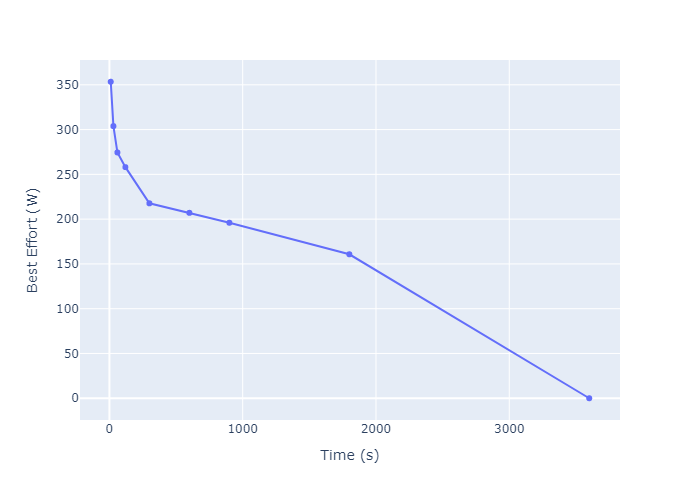

# Programmieruebung_Auf_2-5
Programmieraugaben 2-5
## Aufgabe 2
Einführung Streamlit - Übungen und Erstellung unseres Repositories. Dazu muss PDM heruntergeladen werden und andere Bibliotheken.   

## Aufgabe 3 
Die Datenauswertung mit Pandas wird vertieft. Zuerst wurde in den Notebooks gelesen und uns eingearbeitet, indem wir die Übungen neu gecodet haben. Ziel der Aufgabe ist es erstmals einen interaktiven Plot zu erstellen. 
Dazu haben wir in dem Repository weitergearbeitet und die Daten zunächst in einem Notebook analysiert. Wir haben die Daten aus der activity.csv in einem Pandas DataFrame geladen. Aus den Daten haben wir den Mittelwert der Leistung gebildet, den Maximalwert der Leistung, und den Mittelwert der Herzfrequenz. Dann haben wir die Leistung und die Herzfrequenz über die Zeit geplottet in einem interaktiven Plot. 
Aus dem Datensatz haben wir die Daten in fünf Zonen (Herzfrequenz) geteilt und diese auch als Plot über dem anderen Plot dargestellt. Daraus kann man sehen, wie viel Zeit in welcher Zone verbracht wurde, indem sogar die maximale Herfrequenz mittels einem Button (- und +) verändert werden kann. Darunter befindet sich ein Fenster mit der durschnittlichen Leistung in den Zonen. 

## Aufgabe 4 
Die Aufgabe war, dass eine Leistungskurve erstellt wird basierend auf den Leistungsdaten in Watt und der Zeit in Minuten oder Sekunden. Es wird ein Algorithmus geschrieben, welcher die Peaks in einem EKG-Signal findet, um daraus die Herzfrequenz zu bestimmen. Dabei soll die Funktion für alle Leistungen in Watt anwendbar sein, die als Serie oder numpy-Array vorliegen. 
Zunächst haben wir ein Dataframe erstellt, was die Leistung und die Zeit enthält. Daraus haben wir im Anschluss einen Plot erstellt, der die PowerCurve darstellt. 
 

## Aufgabe 5
In Aufgabe 5 fügen wir erstmals Klassen ein und arbeiten mit ihnen, indem wir diese dann im main.py einfügen. Zuerst haben wir person.py und ekgdata.py angelegt. Dafür haben wir den vorhandenen Code von person.py verwendet und in unserem person.py eingefügt. Dann wurde calc_age() angelegt, welche das Alter basierend auf dem Geburtsjahr anzeigen soll und danach calc_max_heart_rate(), die die maximale Herzfrequenz basierend auf dem Alter und dem Geschlecht berechnet. Da das Geschlecht von den Personen in unserem Datensatz noch nicht vorhanden war, haben wir dieses hinzugefügt. Zuletzt fügen wir load_by_id() hinzu, was eine Person instanziieren soll anhan der ID und der Datenbank. Diese load_by_id() ist allerdings nur im Code zu finden, nicht aber auf der Website, weil jede Person nur eine ID hat und es deswegen realtiv sinnbefreit wäre. 

Nachdem person.py erfolgreich in main.py eingefügt wurde, haben wir uns nun dem EKG-Test gewidmet. Dazu haben wir wieder von dem vorhandenen ekgdata.py den Code in unsere ekgdata.py eingefügt. load_by_id() wird angelegt. Beim EKG-Test ist es allerdings schon wichtig diesen Code nicht nur im Code zu schreiben, sondern auch auf streamlit einzubauen, weil es pro Person auch mehr EKG-Daten geben kann und dann alle angezeigt werden müssen mit einer dropdown-list. Dann wird die find_peaks() angelegt, die die Peaks in den EKG-Daten finden soll und dann die Daten als Attribut hinzufügt. estimate_hr() berechnet dann die Herzfrequenz basierend auf diesen Peaks. Zum Schluss wird noch ein plot_time_series() angelegt, der die EKG-Daten mit den gefundenen Peaks plotten soll. 

### Wie kann also nun die App gestartet werden? 
Um die EKG-Analyse-App zu starten, muss zunächst sichergestellt werden, dass alle notwendigen Abhängigkeiten installiert sind. Dazu wird das Projekt mit dem Python-Paketmanager PDM verwaltet. Danach führt man im Projektverzeichnis den Befehl pdm install aus, um alle benötigten Pakete zu installieren. Anschließend kann die App mit dem Befehl streamlit run main.py gestartet werden. Streamlit öffnet dann automatisch einen neuen Tab im Browser, in dem die Benutzeroberfläche der App angezeigt wird. Dort kann eine Person ausgewählt und der entsprechende EKG-Test analysiert und visualisiert werden.